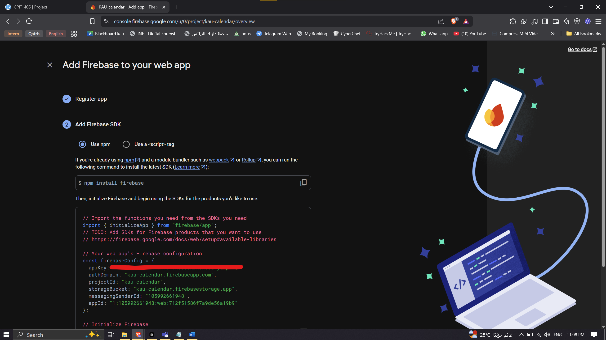
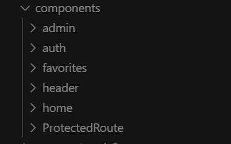
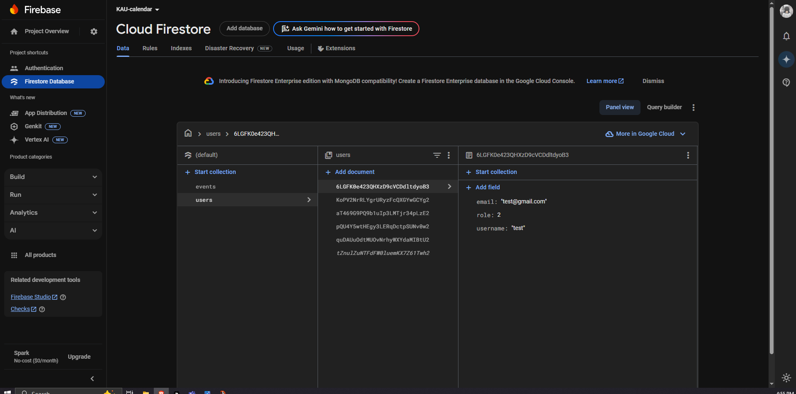
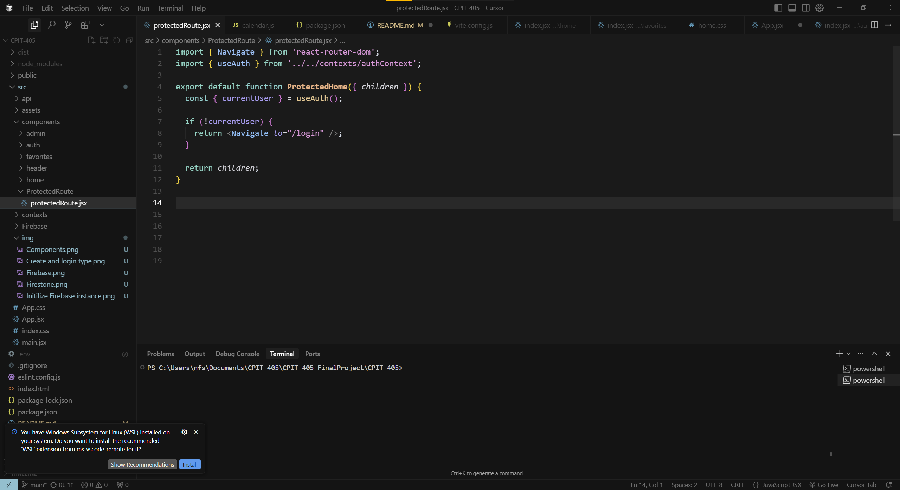
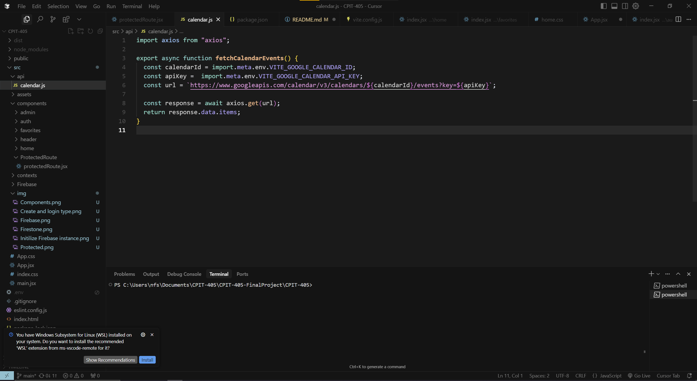
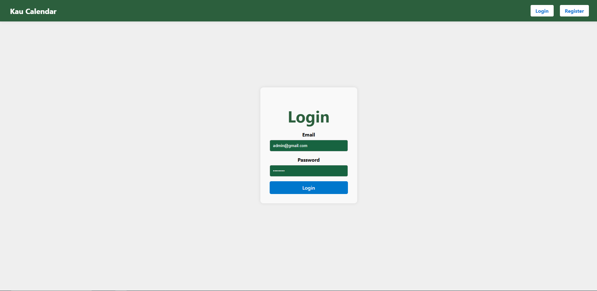
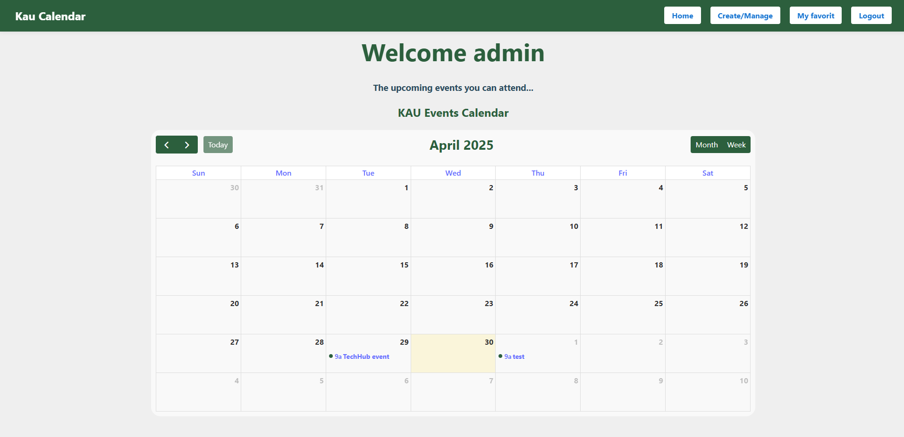
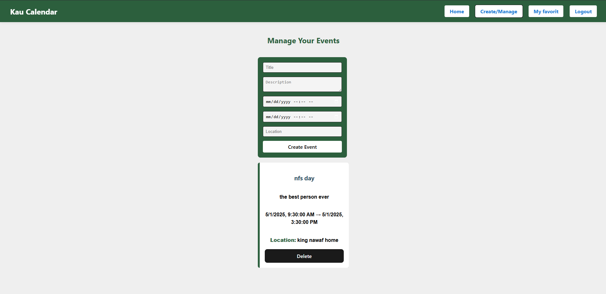

# KAU Event Calendar App

🔴 **Problem**

Students miss events because announcements are scattered.

Organizations struggle to promote events.

Need a centralized calendar platform for events at KAU.

---------------------------------------------------------

**Target Users**

Students → Discover & Join events

Organizers → Create & Manage events

Admins → Manage everything (events + users maybe)

Staff → Post official university events (treated like organizers/admins)

---------------------------------------------------------

**Pages** 

1- Auth 

2- Home

3- My favorites 

4- Craete/Manage

## Implementation 

####Creating the auth methods 

### Activiate Firebase auth method 
 

### Initilize Firebase auth method 
 

### Create the pages 
 

### Firestone to store users data  
 

### Protected route
 

### Google Calendar API 
 

### Login page
 

### Home page
 

### Create and Manage page 
 
